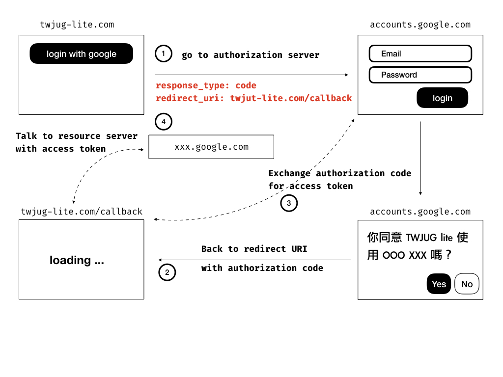

# 實戰指引

理解 OAuth Authorization Code Flow 的概念後，接下來的問題是要怎麼把它運用在實作上呢？圖中的編號就是這次 Workshop 練習的內容，以下分階段說明實作的任務。

**實用的參考資料**

* [auth0 的 authorization code grant 解說](https://auth0.com/docs/api-auth/tutorials/authorization-code-grant)，我們用它來查詢要放哪些參數 (比直接看 OAuth 2.0 Specification 易懂)。
* GitHub 的開發者文件
  * [Creating an OAuth App](https://developer.github.com/apps/building-oauth-apps/creating-an-oauth-app/)，註冊一個新的 OAuth Client 的方法。
  * [Github OAuth App Scopes](https://developer.github.com/apps/building-oauth-apps/understanding-scopes-for-oauth-apps/#available-scopes)，不用的應用程式支援不同的 Scope。
  * [Authorizing OAuth Apps](https://developer.github.com/apps/building-oauth-apps/authorizing-oauth-apps/)，實際上要用的 Authorization Endpoints 資料都會由這查得到。
  * [GitHub API Authentication](https://developer.github.com/v3/#authentication)，獲得 Access Token 後要怎麼發 Request 要參考這裡的範例。

## Step 0

真正進入實作前，我們可以先蒐集好必要的資訊：

* 取得 Client ID 與 Client Secret：找到如何註冊它的文件，並完成註冊。
* 取得 Authorization Server Endpoints
  * 認證用的 Endpoint 是什麼？
  * 交換 Access Token 的 Endpoint 是什麼？
* 取得 Resource Server 的 Endpoints
  * 怎麼取得 User Email (這次練習的目標)

## Step 1

情境：使用者在瀏覽器上點擊『login with google』，程式要將它導至 `Authorization Server`。這步驟其實只是要組出 URL 並發送 HTTP GET 就行了，它可以是簡單的 `<a>超連結</a>` 或是 304 Redirect。

URL 得包含參數：

* client_id：註冊完 Client 後會取得
* response_type=code：這次練習以 Authorization Code Flow 為目標，因此這組參數就是這樣的填法。
* scope：看要開哪些權限，多個時以空白相隔。
* state：選填，但建議填寫。
* redirect_uri：註冊 Client 時填的 callback url

## Step 2

情境：實作一個 Endpoint 接收 Authorization Server 的 Redirect。

這步驟是使用者在 Authorization Server 完成認證與授權的動作後我方的程式要接著處理的部分，以 Spring Web 來說，其實就只是在 Controller 內開個 HTTP GET 的方法，等待接收資料而已。

期望上，我們會收到參數：

* code
* state 

在下一步會帶上這些參數，進行 access token 交換。

## Step 3

情境：使用者同意授權，取得 `code` 之後，向 Authorization Server 交換 access_token。

這時需要利用 access_token 交換的 Endpoint，發出 HTTP POST 請求，包含這些參數：

* code：callback 傳回來的 code
* state：callback 傳回來的 state
* grant_type=authorization_code：交換 access_token 固定這麼寫的
* client_id：註冊 Client 後獲得的資料
* client_secret：註冊 Client 後獲得的資料

## Step 4

情境：取得 Access Token 後，利用 API 取得需要的資訊

